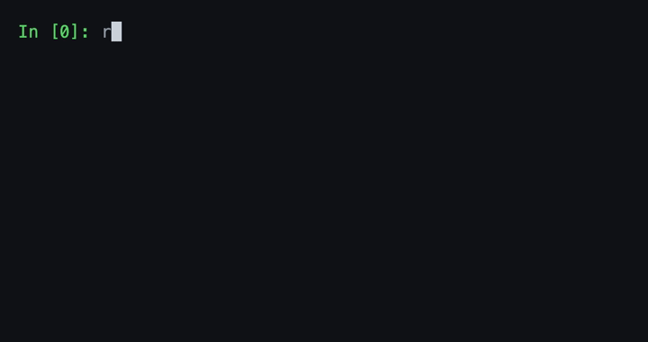

# VCAL

VCAL is a **V**erilog **cal**culator: an interactive REPL for evaluating Verilog expressions when writing or debugging Verilog code. It follows a subset of IEEE 1364-2005, focused on constants, expressions, and variables.

## Use cases

- Quickly test expression snippets and system functions
- Explore syntax and experiment with ideas
- Debug and inspect variables
- Use it as a calculator or learning tool

## Install & run

Download a pre-built binary for your platform from the [GitHub releases page](https://github.com/kele14x/vcal/releases), extract the archive, and run `vcal` to start the interactive REPL.

To build from source instead:

```sh
cargo run             # interactive REPL
cargo build           # build the binary
cargo test            # tests
```

## Example



## Documentation

vcal aims to follow IEEE 1364-2005. See [doc/non-standard.md](doc/non-standard.md) for the vcal-specific divergences from the LRM.

## License

Licensed under either of [Apache License, Version 2.0](LICENSE-APACHE) or [MIT license](LICENSE-MIT) at your option.

Unless you explicitly state otherwise, any contribution intentionally submitted for inclusion in this work by you, as defined in the Apache-2.0 license, shall be dual licensed as above, without any additional terms or conditions.
